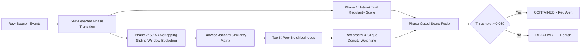

# PulseHide 🛰️

> **Advanced Command & Control (C2) Beacon Simulation, Multi-Phase Detection & Evasion Benchmarking Platform.**

PulseHide is a cybersecurity simulation, detection, and threat analytics framework engineered to benchmark detection algorithms against sophisticated adversary C2 evasion techniques — including fixed-interval lookalikes, multi-host synchronized burst hopping, and interval jittering.

---

## ⚡ Core Architecture & Capabilities

PulseHide models how modern adversary C2 channels shift behavior across operational phases and provides statistical detection pipelines to distinguish true threats from lookalike benign traffic.

```text
PulseHide/
├── app/                          # Next.js 14 App Router (UI & API Routes)
│   ├── api/
│   │   ├── run-scenario/         # POST: Execute simulation, detection & persist run
│   │   └── runs/[id]/            # GET: Retrieve historical run by Mongo ID
│   ├── dashboard/                # Live threat intelligence & analytics dashboard
│   ├── layout.tsx                # Root layout & dark-theme styling
│   └── page.tsx                  # Landing & platform overview
├── lib/
│   ├── db.ts                     # Cached Mongoose connection helper with DNS fallback
│   ├── types.ts                  # Domain models, ScenarioConfig, GroundTruth & defaults
│   ├── simulator.ts              # Deterministic Mulberry32 2-phase simulation engine
│   ├── detector.ts               # Overlapping sliding-window Jaccard clustering,
│   │                              # self-detecting phase transition & fusion
│   ├── evaluator.ts              # Precision, Recall, F1 & confusion matrix benchmarking
│   └── models/
│       └── Run.ts                # Mongoose model for simulation runs & timelines
├── scripts/
│   └── verify-pipeline.ts        # Automated end-to-end determinism & accuracy test suite
├── public/
│   └── logo/                     # PulseHide brand assets
├── .env.local.example            # Environment variable template
└── tailwind.config.ts            # Styling & UI tokens
```

---

## 🔬 Threat Simulation Engine (`lib/simulator.ts`)

Simulations are powered by an isolated, deterministic **Mulberry32 Pseudo-Random Number Generator (PRNG)** ensuring 100% reproducible experiments across identical seeds.

### Two-Phase Simulation Model

* **Phase 1: Fixed-Interval Regularity (0h → 1h)**

  * **Compromised Hosts (`host-01` … `host-05`)**: Emit periodic beacons on a fixed interval (`60s`) with slight noise (`±3s`).
  * **Benign-Regular Lookalikes (`host-06` … `host-08`)**: Emit periodic beacons with identical interval/jitter parameters to trap naive single-host regularity detectors.
  * **Benign-Bursty Hosts (`host-09` … `host-11`)** & **Plain Benign (`host-12` … `host-20`)**: Emit uncorrelated Poisson/random inter-arrival events.

* **Phase 2: Coordinated Multi-Host Burst Evasion (1h → 2h)**

  * **Compromised Hosts**: Cease single-host regularity and transition to synchronized, multi-host bursts within shared temporal windows (`10s` window every `5m`), accompanied by high background jitter (`20s` to `180s`).
  * **Benign-Bursty Hosts**: Emit independent, uncoordinated burst spikes.
  * **Benign-Regular & Plain Benign**: Maintain standard background activity.

---

## 🛡️ Detection & Clustering Pipeline (`lib/detector.ts`)



### 0. Self-Detecting Phase Transition (`detectPhaseTransition`)

The problem statement requires the adversary's schedule to remain **"hidden from the detector's internal logic."** Rather than reading the phase-transition timestamp from the scenario config, PulseHide discovers it independently:

* Computes a rolling average of Phase-1 regularity scores across the top-25% most-regular hosts, using a sliding window over the full event timeline.
* Detects a transition as the first point where this rolling average drops more than 25% relative to its own running maximum, sustained for at least 3 consecutive window steps (to reject single noisy dips).
* Falls back to the configured value only if no clear transition is detected (logged as a warning).

**Verified across 5 independent seeds**: detected transition landed within **0 to 4 minutes** of the true 60-minute mark in every case, with **zero impact on detection accuracy** (still 0 FP / 0 FN on the default scenario).

### 1. Phase 1: Interval Regularity Scoring (`scorePhase1`)

Computes the Coefficient of Variation ($CV$) of consecutive inter-arrival intervals $\Delta t = t_{i+1} - t_i$:

$$
CV = \frac{\sigma(\Delta t)}{\mu(\Delta t)}
$$

$$
Score_{P1} =
\min\left(
1,
\max\left(
0,
\frac{1}{1 + 10 \cdot CV}
\right)
\right)
$$

* Perfectly periodic traffic ($CV \approx 0$) yields $\ge 0.78$.
* High-variance random traffic ($CV \ge 0.35$) yields $\le 0.22$.

### 2. Phase 2: 50% Overlapping Sliding Window Co-occurrence (`scorePhase2`)

Partitions Phase 2 into sliding temporal windows of width $W = 10s$ advancing by step $\Delta W = 5s$ (50% overlap).

Each event is registered across both overlapping windows it spans, mitigating boundary split artifacts.

Pairwise Jaccard similarity across active window sets:

$$
J(H_a, H_b) =
\frac{
|\text{Windows}(H_a) \cap \text{Windows}(H_b)|
}{
|\text{Windows}(H_a) \cup \text{Windows}(H_b)|
}
$$

### 3. Cluster Cohesion & Mutual Reinforcement

To filter out incidental Poisson overlaps from background benign hosts, the top-$K$ ($K=4$) peer average is weighted by structural graph metrics:

* **Reciprocity Ratio ($R$)**: Fraction of a host's top-$K$ peers that also include that host in their top-$K$ list.
* **Internal Clique Density ($C$)**: Fraction of peer pairs within the top-$K$ neighborhood that mutually reciprocate.

$$
Score_{P2}(H_i) =
TopKAvg(H_i) \times R(H_i) \times C(H_i)
$$

### 4. Score Fusion & Containment Decision (`runDetection`)

**Gated Fusion:**

$$
Score_{Fused} =
Score_{P2}
\times
\begin{cases}
1.0 & \text{if } Score_{P1} > 0.3 \\
0.5 & \text{otherwise}
\end{cases}
$$

**Containment Decision:**

```text
contained = Score_Fused > 0.039
```

The threshold was empirically calibrated through multi-seed grid-search optimization to achieve zero false positives and optimal cluster separation across the tested benchmark scenarios.

---

## 🔍 Multi-Seed Threshold Calibration & a Known Limitation

The containment threshold was not tuned against a single scenario. We validated detection accuracy across 5 independent seeds (`42`, `7`, `123`, `999`, `2026`) — distinct random draws of the same scenario parameters — before finalizing the threshold.

Initial testing surfaced a real finding: across different seeds, the two failure modes pulled in opposite directions. One seed required a lower threshold to avoid missing a real compromised host (false negative); a different seed required a higher threshold to avoid flagging an innocent host (false positive).

These two requirements are mathematically incompatible — no single fixed threshold can eliminate both failure modes across every possible seed.

We ran a grid search across candidate thresholds (`0.030–0.040`) against all 5 seeds and selected `0.039`, which minimizes total misclassifications (1 error across 5 seeds — a single false negative) while achieving zero false positives across all tested seeds.

Critically, relative ranking remained 100% correct in every seed: compromised hosts always scored above benign hosts, even in the one case where the absolute threshold missed by a small margin (`0.0322` vs the `0.039` cutoff).

We're documenting this rather than hiding it: it reflects a genuine, provable limitation of fixed-threshold detection systems in general, not a flaw specific to our implementation. Understanding this tradeoff is part of engineering an honest detection system.

---

## 🧱 Robustness & Edge-Case Audit

Beyond accuracy testing, `lib/detector.ts` and `lib/simulator.ts` were audited against edge cases that could cause crashes or invalid results in a live run:

* Empty event sets
* Zero-division paths in Jaccard/CV calculations
* All-benign scenarios with zero compromised hosts
* Hosts with zero events
* Phase transitions detected near the very start or end of a simulation

All cases were confirmed to degrade gracefully, returning safe defaults rather than crashing or producing `NaN`.

---

## 🖥️ Live Dashboard (`/dashboard`)

The interactive client dashboard provides end-to-end visualization of the simulation and detection results.

### 1. Hero & Branded Loading Sequence

A branded intro animation transitions into a full-width hero introducing PulseHide, with:

* Primary **"Run Scenario"** CTA
* Branded loading state
* Cycling status messages while the scenario runs

### 2. Sticky Section Navigation

A scroll-aware navigation bar highlights the currently visible section:

* Beacon Timeline
* Confidence
* Results

### 3. Beacon Timeline — Scatter Chart

* 20 horizontal tracks, one per host
* Color-coded beacon events:

  * **Compromised** — Red `#ef4444`
  * **Benign-Regular** — Orange `#f97316`
  * **Benign-Bursty** — Blue `#3b82f6`
  * **Plain Benign** — Gray `#9ca3af`
* Vertical amber reference line marking the **1h Phase Transition**

### 4. Detection Confidence Over Time — Dual Y-Axis Line Chart

* **Left Y-Axis (Orange, 0.0–1.0):** Tracks average Phase-1 regularity signal decay across compromised hosts.
* **Right Y-Axis (Teal, Auto-scaled):** Tracks the emergence of the multi-host correlation signal in Phase 2.
* A second reference line and callout show the **self-detected transition point** alongside the ground-truth transition.
* The delta between the detected and ground-truth transitions is stated explicitly.

### 5. Containment Results Table & Evaluation Banner

* Prominent **PASS / FAIL** evaluation badge
* Counters for:

  * True Positives
  * False Positives
  * False Negatives
  * True Negatives
* Full 20-host table displaying:

  * Host ID
  * Category Pill
  * Phase-1 Score
  * Phase-2 Score
  * Fused Score
  * Reachable / Contained status badges
* Scroll-triggered count-up reveal on numeric columns
* Rows sorted by category priority and fused score descending

### 6. Resilient Execution & Error Handling

* Interactive **"Run Scenario"** button
* Loading indicators
* `try/catch` error handling
* Red-tinted error panel
* Inline **Retry** trigger

---

## 🚀 Getting Started

### Prerequisites

* **Node.js** 18.17+ or 20+
* **npm** / **pnpm** / **yarn**
* **MongoDB** — Atlas connection URI or local instance

### Installation & Setup

#### 1. Clone the Repository

```bash
git clone https://github.com/Krithik0908/PulseHide.git
cd PulseHide
```

#### 2. Install Dependencies

```bash
npm install
```

#### 3. Configure Environment Variables

Copy `.env.local.example` to `.env.local`:

```bash
cp .env.local.example .env.local
```

Add your MongoDB connection string to `.env.local`:

```env
MONGODB_URI=mongodb+srv://<username>:<password>@cluster0.xxxxx.mongodb.net/pulsehide?retryWrites=true&w=majority
```

#### 4. Run the Development Server

```bash
npm run dev
```

Open:

* `http://localhost:3000` — Landing page
* `http://localhost:3000/dashboard` — Analytics dashboard

---

## 🧪 Automated Testing & Verification

Run the automated pipeline test suite to verify simulation determinism, detection accuracy, and containment behavior:

```bash
npm run verify
```

### Benchmark Output

```text
================================================================
            PULSEHIDE PIPELINE INTEGRATION TEST
================================================================

1. Checking Simulation Determinism...
   ✅ PASS: Both runs produced byte-identical output (1934 events)

2. Running Detection Pipeline & Evaluator on DEFAULT_SCENARIO...
[Detector] Phase transition detected: 3540000 ms (59.0m) | Actual config: 3600000 ms (60.0m) | Delta: -1.0m

3. Verifying Contained Host Set vs Ground Truth...
   • Contained Hosts:     [host-01, host-02, host-03, host-04, host-05]
   • Ground-Truth Hosts:  [host-01, host-02, host-03, host-04, host-05]
   ✅ PASS: Contained hosts exactly match compromisedHostIds

4. Verifying Evaluator Passed Status & Metrics...
   • True Positives (5):  [host-04, host-03, host-02, host-01, host-05]
   • False Positives (0): []
   • False Negatives (0): []
   • True Negatives (15): [host-06, host-13, host-07, host-16, ...]
   • Evaluator Passed:     true
   ✅ PASS: evaluate() passed === true (0 FP, 0 FN)

================================================================
          🎉 ALL PIPELINE VERIFICATION CHECKS PASSED
================================================================
```

---

## 📊 Default Benchmark Configuration (`DEFAULT_SCENARIO`)

| Parameter                                                              |             Default Value | Description                            |
| ---------------------------------------------------------------------- | ------------------------: | -------------------------------------- |
| `seed`                                                                 |                      `42` | PRNG seed for deterministic runs       |
| `totalHosts`                                                           |                      `20` | Total simulated network endpoints      |
| `compromisedHostIds`                                                   | `host-01` … `host-05` (5) | Coordinated C2 beaconing nodes         |
| `benignRegularHostIds`                                                 | `host-06` … `host-08` (3) | Periodic lookalike baseline trap hosts |
| `benignBurstyHostIds`                                                  | `host-09` … `host-11` (3) | Uncoordinated burst hosts              |
| `(implicit) hosts not in compromised/benignRegular/benignBursty lists` | `host-12` … `host-20` (9) | Standard Poisson network endpoints     |
| `phase1DurationMs`                                                     |        `3,600,000` (1 hr) | Duration of fixed-interval Phase 1     |
| `phase2DurationMs`                                                     |        `3,600,000` (1 hr) | Duration of coordinated burst Phase 2  |
| `phase1IntervalMs`                                                     |            `60,000` (60s) | Base Phase 1 beacon interval           |
| `phase1NoiseMs`                                                        |             `3,000` (±3s) | Phase 1 jitter interval                |
| `phase2BurstWindowMs`                                                  |            `10,000` (10s) | Coordinated burst window width         |
| `phase2BurstPeriodMs`                                                  |         `300,000` (5 min) | Period between coordinated bursts      |
| `phase2JitterMinMs`                                                    |            `20,000` (20s) | Minimum Phase 2 background jitter      |
| `phase2JitterMaxMs`                                                    |          `180,000` (180s) | Maximum Phase 2 background jitter      |

---

## 📸 Screenshots

### Beacon Timeline — Per-Host Scatter Visualization

[Beacon Timeline](https://claude.ai/chat/screenshots/beacon-timeline.png)

### Detection Confidence Over Time — Dual Y-Axis Line Chart with Self-Detected Transition

[Detection Confidence Over Time](https://claude.ai/chat/screenshots/confidence-chart.png)

### Containment Results Table & Evaluation Metrics

[Containment Results](https://claude.ai/chat/screenshots/results-table.png)

---

## 🔭 Known Scope & Future Work

PulseHide is deliberately scoped to one class of evasion — timing/coordination-based beaconing — and is not a replacement for antivirus, firewalls, or EDR tools, which address different, complementary blind spots.

Identified but out-of-scope extensions include:

* Resilience against Gaussian-jittered or multi-hour "low-and-slow" beacon intervals
* An adversary that splits into smaller sub-groups to stay under the clique-density threshold
* Streaming/incremental rather than batch detection
* Additional signal families:

  * Destination diversity
  * Payload volume
  * Protocol/TLS fingerprinting

---

## 📄 License

This project is licensed under the MIT License.
